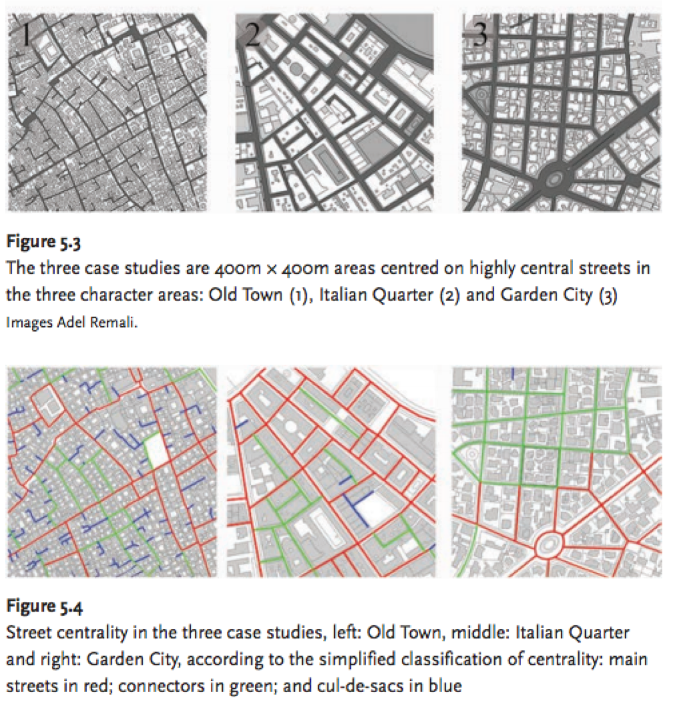

Analisis de accesibilidad peatonal
================

Contexto
--------

Este documento recopila metodos y referentes pare realizar un analisis cuantitativo de accesibilidad peatonal. El foco principal es presentar metodos que estudian las propiedades estructurales de la red de calles y circuitos peatonales en una ciudad para que puedan ser aplicados en Estudio Urbano de Espacios de Uso Publico a partir de un analisis de accesibilidad peatonal.

Las calles centrales son las mas importantes
--------------------------------------------

Estudios de redes viales que demuestran que lugares mejores conectados tienen mayor uso e importancia en la morfología y estructura urbana. Las 'redes viales' son una vista simplificada de las ciudades que capturan gran parte de su estructura y organizacion. En este contexto, la propiedad de la 'red' que mejor representa su estructura es la 'intermediacion'.

La [intermediación («betweenness centrality»)](https://es.wikipedia.org/wiki/Centralidad#Intermediaci%C3%B3n) es una medida que cuantifica la frecuencia o el número de veces que un nodo actúa como un puente a lo largo del camino más corto entre otros dos nodos.

La siguiente imagen muestra los resultados de un estudio de centralidad que compara la estructura urbana 'natural organica' de Venecia con la estructura 'artificial planificada' de Richmond. Los mapas de centralidad permiten indetificar la jerarquia y esqueleto de los sistemas urbanos.

*Porta, S., Crucitti, P., & Latora, V. (2006). 'The Network Analysis of Urban Streets: A Primal Approach'* [(ver estudio)](http://journals.sagepub.com/doi/pdf/10.1068/b32045)

Como se puede incrementar la accesibilidad Peatonal?
----------------------------------------------------

La capacidad de 'intermediacion' de un sistema se puede modificar o mejorar anadiendo o eliminando nodos, o mejorando la capacidad de 'carga' de sus 'caminos'. Es decir, la 'red vial' puede incrementar su capacidad de mover peatones si se intervienen sus intersecciones y mejoran sus espacios peatonales. El analisis cuantitativo de la centralidad de la 'red vial' permite identificar patrones de conexión e interacción entre las distintas partes del sistema urbano. Es esperable que este analisis sirva como guia para identificar donde es mas eficiente intervenir considerando las propiedades del sistema.

Calidad de la Calle, Vitalidad de la Calle, Centralidad de la Calle
-------------------------------------------------------------------

Es siguiente estudio corresponde a un analisis del rol de la forma urbana y del espacio publico en particalar para satisfacer las necesidades de interaccion social.

Cual es la capacidad que tienen las estructura de calles tradicionales para 'construir lugar'(place-making)?

Se argumenta que la centralidad esta asociada con la capacidad de la ciudad para desarrollar una diversidad e intensidad de usos y usarios.

El estudio compara medidas de centralidad, calidad de fachadas y vida urbana, y demuestra una relacion positiva entre estas variables.

 

*Remali, Porta, Romice & Abudib (2013). 'Street Quality, Street Life, Street Centrality'* [(ver estudio)](https://www.jstor.org/stable/pdf/j.ctt1g69z0m.13.pdf?refreqid=excelsior%3A3ced47b1cadac089f33d18510cddb7fa)
